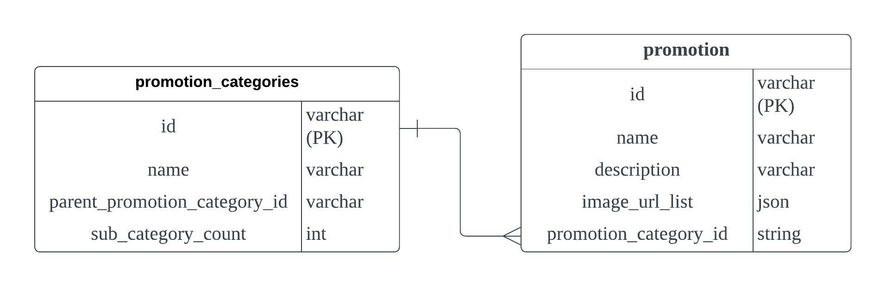

# offbeat test

 

### Description

---

A RESTful API server built by Nestjs, MySQL and TypeORM

 

### Getting started

---

Checkout to master branch
`git checkout master`

Pull latest update from remote repository
`git pull`

Install dependencies
`npm install`

Create and configure `.env` with reference in `.env.example`

Create database in MySQL server
`CREATE DATABASE offbeat_test;`

Start the server, since synchronize is set to true, TypeORM will create the tables with the related entities
`npm run start`

 

### Design

---

 

### Testing

---

If you are using Postman, you can import `offbeat_test.postman_collection.json` into Postman and call the API with the collection.

^ Postman collection overview

Unit testing and end-to-end testing are implemented in this application, simply run the tests by below commands.

Run all unit tests
`npm run test`

Run all e2e tests
`npm run test:e2e`

 

### Afterthought

---

-   TODO
